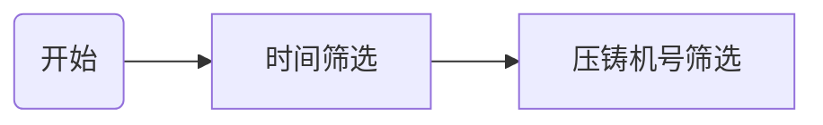

# 开发日志

## 代码流程

### 筛选条件

- 压铸机号
  
  1号压铸机 ，2号压铸机
- 模具号

- 时间

## 统计直方图

增加曲线分析固定参数条件下产品的不良率

## Logistic回归分析

下一阶段任务：

- 不同压铸机、不同机种、不同模具号各自训练一个模型
- 每个参数对产品质量影响大小
- 每个参数的逻辑回归曲线
- 使用训练的模型进行预测

## 不同压铸参数条件下的产品不良率

x轴列表